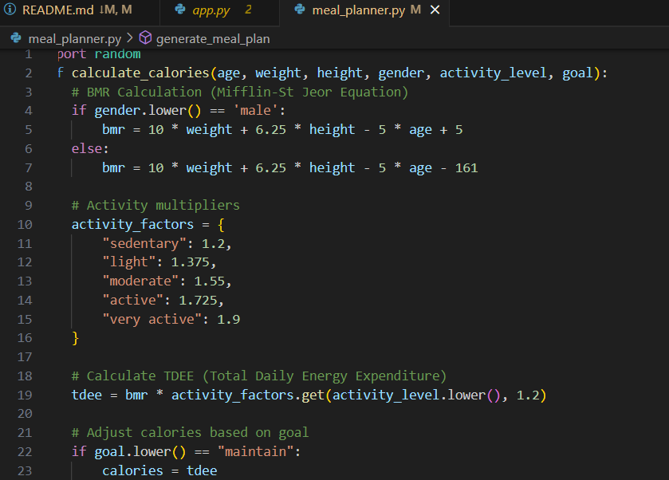
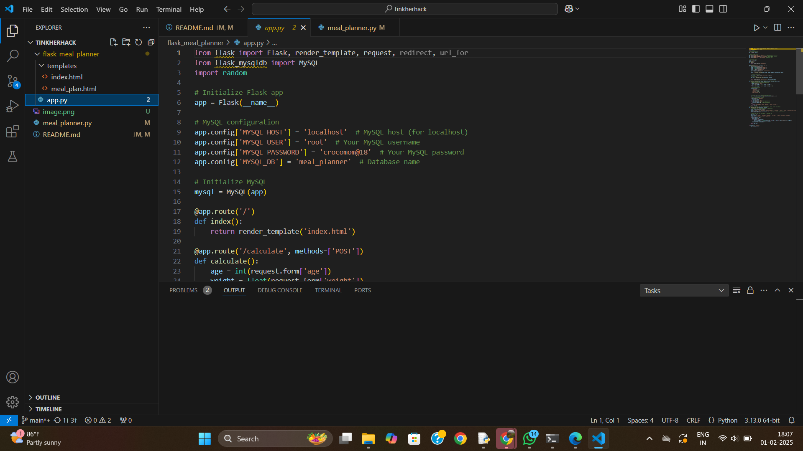
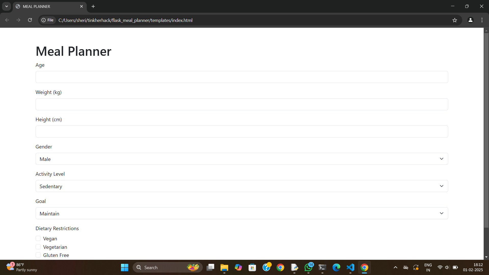

# HEALTHY MEAL PLANNER
## TEAM NAME : SSS

## Team Members
### Sarangi Sujith - CET Trivandrum
### Saniya Amstrong - CET Trivandrum
### Sherin Saju - CET Trivandrum
## HOSTED PROJECT LINK
### https://github.com/sherinsaju19/tinkherhack
## HEALTHY MEAL PLANNER
### A Healthy Meal Planner provides a personalised 3-meal-a-day weekly plan tailored to an individual's specific needs based on their height, weight, age and activity level. By inputing their unique characteristics, users receive a customized meal plan that ensures they meet their daily calorie and nutritional requirements, supporting their overall health and wellness and goals. This comprehensive meal planner offers the weekly schedule of breakfast, lunch and dinner options, complete with recipies and portion sizes, to help users achieve a balanced and sustainable diet.
## PROBLEM STATEMENT
### Many individuals struggle to maintain a healthy diet due to lack of time, knowledge, and personalized guidance. Existing meal planning solutions often provide generic plans that fail to account for individual nutritional needs, leading to ineffective and unsustainable diet plans. As a result, individuals may experience frustration, nutrient deficiencies, and decreased motivation to adopt healthy eating habits.
## SOLUTION
### Our solution is a user-friendly, online meal planning platform that provides personalized, 3-meal-a-day weekly plans based on individual nutritional needs and preferences.Users receive tailored meal plans that meet their unique nutritional needs and preferences.
## TECHNICAL DETAILS
### TECHNOLOGIES/ COMPONENTS USED
#### Python, MySQL
#### flask 
#### html
#### Pavilion hp laptop(windows 11)
#### Toshiba
## INSTALLATION
### Visual Studio Code
### github
### MySQL
### screenshot
 
### MAIN CODE OF THE PROJECT

### CODE OF THE APPLICATION

FRONT PAGE OF THE WEBSITE
## VIDEO

https://github.com/user-attachments/assets/84e70eaf-7a02-4993-bd43-b9b71dcb1c65

## TEAM CONTRIBUTION
### SARANGI - MEAL PLANNER
### SANIYA - TEMPLATE
### SHERIN - APP.PY
